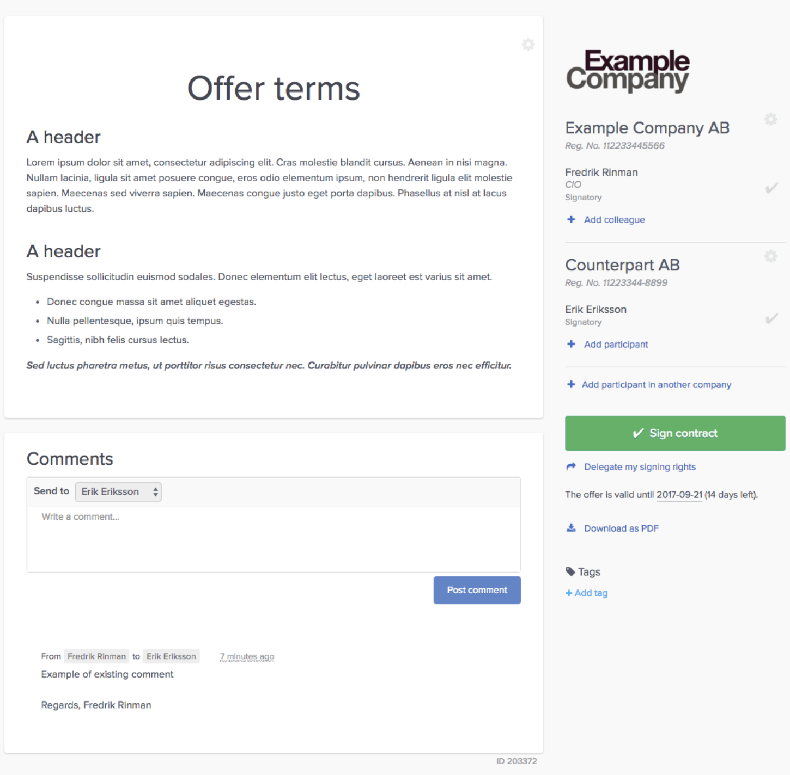
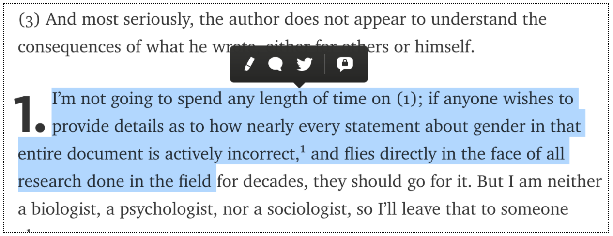

Oneflow - Front-End Assignment
------------------------------

## General

You must use this boilerplate as the starting point of your project. All of your commits must be here, we want to see how you work.

**Register everything**: your tests/spikes, ideas if you had more time (explain how would you solve things), decisions you've made (and why), the architecture you chose. Add a `COMMENTS.md` or a `HISTORY.md` to show us your thoughts and ideas.

## The assignment

At Oneflow, the main resource is a contract. The contracts are viewed, edited and signed in a single web view. The view is (mostly) the same for both our customers and their counterparties. The view looks something like this:


*Figure 1: A simple contract with comments (desktop)*

- Create a simple web app with some contract data that consists of richly formatted text (`HTML` tags: `h1-h4`, `p`, `ol/ul/li`, `img`, `hr`). See [below](#rtf-example) for suggested contract data. 

- The aim is to be able to select some of the richly formatted text and add a comment. 

- The comment once entered, should go to a separate section below the text.

- Clicking on the comment should take us back to the selection in the text, further up the page.

- A commented text also needs to be highlighted, indicating that there is a comment for it.


*Figure 2: Ability to add comments to a text on the page (example)*

## Requirements

- Your solution works event when the selection spans over multiple paragraphs (tags) and not necessarily from start to the end of the paragraph/tag.

- Your solution works even after the commented text is edited/changed/deleted.

- Your solution uses a data structure that makes it possible to persist (e.g. local storage) both comments and richly formatted text in such a way that they can both be displayed at a later time (after reload). The data structure is more important than actually being able to save and load it.

- Your solution is able to handle varying screen sizes (tablet and up).

## Technical assumptions

- You should use React

- Assume a modern browser, if necessary, for your solution.

- Assume we enter plain text as comments, without formatting.

- You do not need to use an actual WYSIWYG editor, but it's important that you handle changes on the richly formatted text (e.g. editing via dev tools is sufficient).

- You can be creative with the design and layout of your solution, no need to implement the exact same contract view.

## The boilerplate

This boilerplate was created with `create-react-app`, so you don't need to worry about minor details. But still, you are free to `eject` from it and create your own setup, if you want.

#### Commands

- `yarn start` starts the development server at `localhost:3000`
- `yarn build` builds the project for production
- `yarn test` run the tests
- `yarn eject` ejects from the default configuration, enabling you to set up things by yourself.

## Extras

Focus on the basics and on solving the main problem, but you can also:

- Use any third-party library you want (with the exception of jQuery and jQuery-dependent stuff).
- Use ES6+ or ES7 features in your `.js` code.
- Test everything that makes sense to be tested (we're talking TDD and automated testing here).

## What are we evaluating?

1. The described features and requirements must work.
2. Any extras you've added to your final solution.
3. Any other creative thing or feature you added by yourself.
4. In general: simplicity, clarity of your solution, architecture, documentation, code style, interface design, and code implementation.

## Tips

- We want you to show us how you work and solve problems.
- It's better if you show us something small that works and is well factored rather than lots of things that does not work quite well.
- It's better if you use open-source libraries and explain why you chose them.
- Automate things.
- If you have any questions, please ask us :)

### Richly formatted text - example <a id="rtf-example"></a>

```html
<h1 class="big-title-align-center">
  Offer terms
</h1>
<h1>
  A header
</h1>
<p>
  Lorem ipsum dolor sit amet, consectetur adipiscing elit. Cras molestie blandit cursus. Aenean in nisi magna. Nullam lacinia, ligula sit amet posuere congue, eros odio elementum ipsum, non hendrerit ligula elit molestie sapien. Maecenas sed viverra sapien. Maecenas congue justo eget porta dapibus. Phasellus at nisl at lacus dapibus luctus.
</p>

<h1>
  A header
</h1>
<p>
  Suspendisse sollicitudin euismod sodales. Donec elementum elit lectus, eget laoreet est varius sit amet.
</p>
<ul>
  <li>
    Donec congue massa sit amet aliquet egestas.
  </li>
  <li>
    Nulla pellentesque, ipsum quis tempus.
  </li>
  <li>
    Sagittis, nibh felis cursus lectus.
  </li>
</ul>
<p>
  <em>
    <strong>
      Sed luctus pharetra metus, ut porttitor risus consectetur nec. Curabitur pulvinar dapibus eros nec efficitur.
    </strong>
  </em>
</p>
```